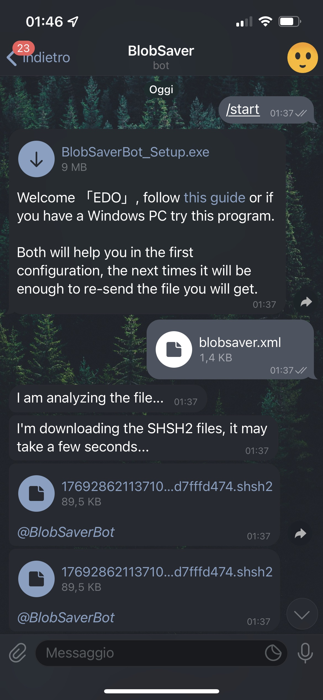
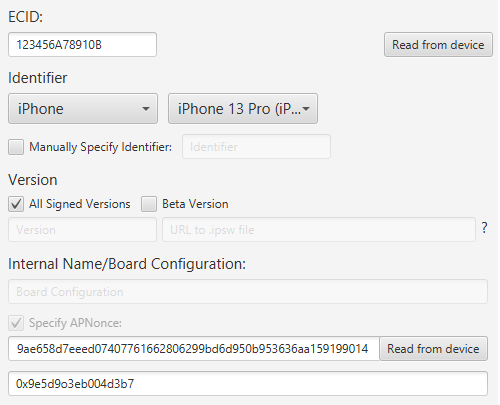

<!-- PROJECT LOGO -->
 

  

  <h3 align="center">BlobSaverBot</h3>

  

    An awesome Telegram bot to save your SHSH2!
     
     
    <a href="https://t.me/BlobSaverBot">Use It</a>
    ·
    <a href="https://telegra.ph/BlobSaverBot-Setup-10-17">Read Guide</a>
  

<!-- TABLE OF CONTENTS -->

  
Table of Contents

  <ol>
    <li>
      <a href="#about-the-project">About The Project</a>
      <ul>
        <li><a href="#built-with">Built With</a></li>
      </ul>
    </li>
    <li>
      <a href="#getting-started">Getting Started</a>
      <ul>
        <li><a href="#prerequisites">Prerequisites</a></li>
        <li><a href="#setup">Setup</a></li>
      </ul>
    </li>
    <li><a href="#usage">Usage</a></li>
    <li><a href="#license">License</a></li>
    <li><a href="#contact">Contact</a></li>
  </ol>

<!-- ABOUT THE PROJECT -->
## About The Project

Saving SHSH2 files is very important for those who are part of the Jailbreak community,
unfortunately we don't always have time to get to our computer to do it or we don't remember the data to enter in the various websites.

That's why I created @BlobSaverBot, with this bot you will only have to face a first configuration on the PC
(Guided by an article that the bot will send you or by a simple program I created for Windows users),
after it you will get a file that just forward to the bot every time you want to save the SHSH2 of the currently signed versions.

The file also supports multiple devices so if sent to the bot it will automatically save you SHSH2 of multiple devices,
so as to make everything even more convenient and faster.

(<a href="#top">back to top</a>)

### Built With

To create this bot I used:

* [Python3](https://www.python.org/)
* [Pyrogram](https://github.com/pyrogram/pyrogram)
* [BlobSaver](https://github.com/airsquared/blobsaver)
* [IPSW.me API](https://ipsw.me/)

(<a href="#top">back to top</a>)

<!-- GETTING STARTED -->
## Getting Started

Here is a guide to using the bot for the first time:

### Prerequisites

iCloud

iTunes

[BlobSaver](https://github.com/airsquared/blobsaver)

### Setup

    - Open BlobSaver

    - Connect your device to the PC

    - Press 'Read from device' [top right]

    - Check 'Specify APNonce' [bottom left]

    - Press 'Read from device' [bottom right]
    The device will restart (iTunes or other Apple services may open, close them only when finished)

You should have a screen similar to this: 

    - Press 'Save Device' [bottom right]
    You can enter any name you want

    - Press 'File' [top left]

    - Press 'Export Saved Devices...'

    - Choose where you want to save the file and then confirm

### Now send this file to <a href="https://t.me/BlobSaverBot">@BlobSaverBot</a> on Telegram!

(<a href="#top">back to top</a>)

<!-- USAGE EXAMPLES -->
## Usage

Once you have followed the <a href="#setup">Setup</a>, just forward the file obtained to the bot every time you want to save the SHSH2 files,
if you want to add a device, just go through the <a href="#setup">Setup</a> again to get a new file with the new device added.

(<a href="#top">back to top</a>)

<!-- LICENSE -->
## License

Distributed under the GNU Affero General Public License v3.0. See <a href="https://github.com/Ed0ardo/BlobSaverBot/blob/main/LICENSE">LICENSE</a> for more information.

(<a href="#top">back to top</a>)

<!-- CONTACT -->
## Contact

Telegram: [@EDev9](https://t.me/EDev9)

Project Link: [https://github.com/Ed0ardo/BlobSaverBot](https://github.com/Ed0ardo/BlobSaverBot)

(<a href="#top">back to top</a>)

